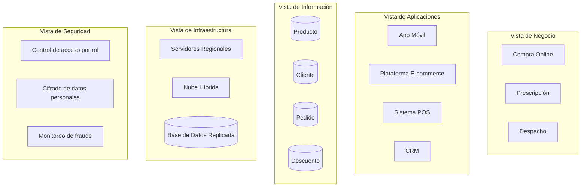
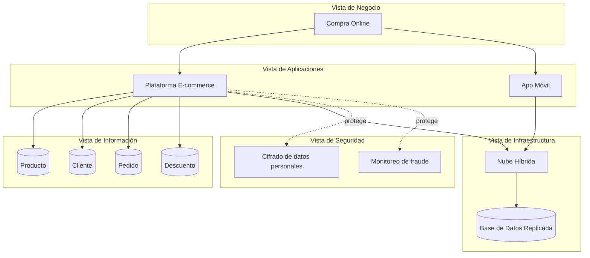

# 🧭 Guía Paso a Paso: Integración de Vistas de Arquitectura

Esta guía complementa el `README.md` del taller. A diferencia de los talleres anteriores, aquí no se construye una vista nueva: se **integran** las que ya se hicieron en los Talleres 1 a 6 (negocio, información, aplicaciones, infraestructura y seguridad) en un solo tablero coherente, primero sobre el caso base de FarmApp (Parte 1) y luego sobre el cliente real (Parte 2).

El diagrama de ejemplo de esta guía está escrito en [Mermaid](https://mermaid.js.org/) y se renderiza automáticamente al ver este archivo en GitHub.

---

## 1. Metodología en 5 pasos

1. **Organizar las vistas en capas** — defina las 5 capas del tablero (negocio, aplicaciones, información, infraestructura, seguridad), una debajo de otra.
2. **Ubicar los elementos de cada vista dentro de su capa** — transcriba lo ya definido en los talleres anteriores, sin conectar todavía.
3. **Trazar relaciones verticales entre capas** — para un proceso de negocio a la vez, conecte cada elemento con la aplicación que lo soporta, la aplicación con su infraestructura, y ambas con la información y el control de seguridad que usan.
4. **Redactar la narrativa de coherencia** — explique en texto **por qué** esas conexiones tienen sentido y qué decisiones de talleres anteriores las originaron.
5. **Revisar consistencia** — verifique que ningún elemento quede "huérfano" (sin conexión hacia arriba ni hacia abajo) y que la narrativa cubra las 5 capas.

---

## 2. Ejemplo guiado: Tablero integrado de FarmApp

### Paso 1 — Organizar las vistas en capas

| Capa | Contenido esperado |
|---|---|
| Negocio | Procesos: Compra Online, Prescripción, Despacho |
| Aplicaciones | App Móvil, Plataforma E-commerce, Sistema POS, CRM |
| Información | Entidades: Producto, Cliente, Pedido, Descuento |
| Infraestructura | Servidores Regionales, Nube Híbrida, Base de Datos Replicada |
| Seguridad | Control de acceso por rol, Cifrado de datos personales, Monitoreo de fraude |

### Paso 2 — Ubicar los elementos de cada vista

Se transcribe el inventario completo de cada capa, sin conectar nada todavía. Este es el punto de partida — normalmente ya existe en los entregables de los Talleres 1 a 6.

### Paso 3 — Trazar relaciones verticales entre capas

Conectar las 5 capas completas de una vez satura el tablero. Se traza primero **un hilo de negocio completo**, de punta a punta: el proceso **Compra Online**. El mismo método se repite después para Prescripción y Despacho.

### Paso 4 — Redactar la narrativa de coherencia

La narrativa no describe el diagrama — explica las decisiones detrás de él. Ejemplo para el hilo de Compra Online:

> "El proceso de Compra Online se apoya en la Plataforma E-commerce y en la App Móvil, priorizadas porque la mayoría de las compras de FarmApp ya ocurren desde dispositivos móviles. Ambas comparten las mismas entidades de información (Producto, Cliente, Pedido, Descuento) para evitar inconsistencias de inventario entre canales. Corren sobre la Nube Híbrida con Base de Datos Replicada — decisión tomada en el Taller 4 para tolerar picos de demanda en campañas promocionales. El cifrado de datos personales y el monitoreo de fraude se aplican en este punto porque el proceso involucra pago electrónico, el activo más sensible identificado en el Taller 5."

### Paso 5 — Revisar consistencia

Se verifica que cada elemento del hilo tenga al menos una conexión hacia la capa de arriba y una hacia la de abajo (salvo la capa más alta y la más baja). Un elemento sin ninguna marca está huérfano: o sobra en el tablero, o falta trazar su relación.

| Elemento | Capa | ¿Conectado hacia arriba? | ¿Conectado hacia abajo? |
|---|---|---|---|
| Compra Online | Negocio | — (capa más alta) | ✅ E-commerce, App Móvil |
| Plataforma E-commerce | Aplicaciones | ✅ Compra Online | ✅ Info, Nube Híbrida, Seguridad |
| App Móvil | Aplicaciones | ✅ Compra Online | ✅ Nube Híbrida |
| Producto / Cliente / Pedido / Descuento | Información | ✅ E-commerce | — (capa más baja) |
| Nube Híbrida | Infraestructura | ✅ E-commerce, App Móvil | ✅ Base de Datos Replicada |
| Cifrado / Monitoreo de fraude | Seguridad | ✅ E-commerce | — |

---

## 3. Errores comunes a evitar

| Error frecuente | Por qué es un problema | Cómo corregirlo |
|---|---|---|
| Dibujar las 5 vistas por separado sin conectarlas | El tablero se convierte en 5 diagramas pegados, no en una arquitectura integrada | Trace explícitamente las relaciones verticales entre capas (Paso 3) |
| Conectar aplicaciones e infraestructura pero omitir la vista de seguridad | La seguridad queda como un anexo en vez de una decisión arquitectónica | Para cada hilo de negocio, identifique qué control de seguridad protege ese flujo |
| Narrativa que describe el diagrama en vez de justificar las decisiones | No aporta valor sobre lo que ya se ve en el tablero | Explique el "por qué" (ej. por qué esa infraestructura, por qué esas entidades), no el "qué" |
| Elementos de talleres anteriores que no aparecen en el tablero integrado | Da la impresión de que el trabajo previo se descartó | Revise que cada entregable de los Talleres 1–6 tenga un lugar en el tablero final |

---

## 4. Checklist de autoevaluación antes de entregar

- [ ] Las 5 vistas (negocio, información, aplicaciones, infraestructura, seguridad) están representadas como capas del tablero.
- [ ] Se trazó al menos un hilo completo de negocio de punta a punta por las 5 capas.
- [ ] Ningún elemento relevante queda sin conexión hacia arriba o hacia abajo (ver tabla de verificación del Paso 5).
- [ ] La narrativa explica el "por qué" de las conexiones clave, no solo las describe.
- [ ] Los elementos del tablero son consistentes con los entregables de los talleres anteriores (mismos nombres, mismas decisiones).

---

_Esta guía hace parte del Taller 7 de Integración de Vistas de Arquitectura — curso Arquitectura Empresarial, Universidad de La Sabana._
